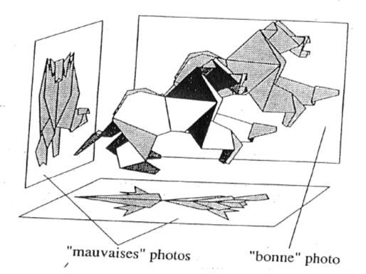

```{r setup, echo = FALSE, include = FALSE}

source("../scripts/00-setup.R", local = knitr::knit_global())

library(kableExtra)
set.seed(999)

```

```{r data, echo = FALSE, include = FALSE}

d <- read_csv2("../data_prod/ee18_interim_recode.csv") %>% 
  rename_all(tolower)

d_acm <- d %>% 
  select("age", "genre", "diplome", "nationalite", "gsp", 
         "sociopro", "menage", 
         "position", "choix", "horaires", "heures_plus", 
         "public_prive", "secteur") %>% 
  mutate_all(factor) %>%  
  drop_na()
```

# Introduction

### Objectifs

+ Montrer **comment réaliser**, avec R et RStudio, des **graphiques** et des **tableaux statistiques sur-mesure**, permettant de présenter et visualiser les résultats d'une analyse géométrique des données.

+ Donner un exemple d'**espace de travail quantitatif reproductible**.

+ Plaider pour l'usage des solutions de **contrôle de version `git`** (intégré à RStudio).

### Avant de commencer

+ Rendez-vous sur le **dépôt GitHub** dédié à cette présentation : https://github.com/APerdoncin/visual_agd

+ Les usagers de GitHub peuvent cloner le dépôt sur leur ordinateur (git clone ...)

+ Les autres peuvent simplement télécharger le contenu du dépôt et le copier dans un dossier dédié sur leur ordinateur (Code > Download ZIP)

+ **Deux scripts à exécuter** :

  + `00-setup` : packages (à installer éventuellement) et options
  + `01-data` : téléchargement, "dézipage" et importation des données de l'EEC 2018

### Un espace de travail reproductible

+ Des données brutes aux résultats et à la rédaction **sans intervention parallèle ou externe sur les données**

+ Une **organisation logique** qui distingue les **types de fichiers** et les **types d'opérations réalisées**

+ La garantie de **retrouver le même résultat** ... à condition d'**appliquer les mêmes procédures**. 

### Git : un ami qui vous veut du bien

+ En finir avec les V1, V2, V142, VDEF ... VDEFDEF ... VDERDESDERS

+ Sourcer et retrouver les modifications réalisées sur les fichiers

+ Travailler de façon collaborative en minimisant les risques de conflits

+ Un petit coût d'entrée... très nettement diminué par l'intégration de Git à RStudio

### Pourquoi le tutoriel sur Quanti ?

+ Nouvelles fonctionnalités et nouveaux packages disponibles : 

  + `explor` (Julien Barnier) ;
  + `FactoMineR` ;
  + `factoextra` ;
  + `GDAtools` (Nicolas Robette) : ggcloud_variables, ggcloud_indiv, ggadd_ellipses, ggadd_interaction, ggadd_supvar.

+ Mais... comment faire pour pouvoir *tout* paramétrer : modalités à représenter, couleurs, symboles, etc. 

+ `ggplot2` : fonctionnalités graphiques surpuissantes pour des graphiques infiniment paramétrables

+ mettre au propre des routines pouvant être adaptées à une diversité de données d'enquête et aux objectifs d'administration de la preuve statistique. 

### Les données

+ Un objet "bac à sable" : le travail intérimaire... sans aucune ambition sociologique (du moins pas aujourd'hui !)

+ De "vraies" données d'enquête : fichier détail de l'EEC 2018 (http://insee.fr/fr/statistiques/4191029#consulter)

+ On travaille directement sur les données recodées, "prêtes-à-jouer" (mais le script de recodage est disponible sur GitHub) : `r nrow(d_acm)` individus et `r ncol(d_acm)` variables.


# Une famille de méthodes graphiques

### Résumer l'information le mieux possible

Analyses géométriques des données incluent notamment :

+ Analyse en composantes principales (ACP)
+ Analyse des correspondances multiples (ACM)
+ Classifications (ascendantes hiérarchies notamment, CAH)
+ Analyse factorielle de tableaux multiples (AFM), etc.

Un principe et résultat commun : fournir la **meilleure description possible des corrélations** dans un jeu de données. [@Volle1997; @Cibois2000; @LeRoux2014]

### Résumer l'information le mieux possible

{width=70%}


### Le parti-pris graphique

+ Un usage répandu dans les enseignements et les publications : ne présenter que le fameux **graphique en croix**

  + un ou plusieurs plans factoriels et les nuages des modalités actives et/ou supplémentaires
  + parfois (rarement) les nuages d'individus encore plus rarement habillé ou structuré

+ Les **résultats statistiques** (fréquences, contributions, coordonnées, cosinus carrés) sont rarement présentés.

### Le parti-pris graphique

+ Usage cohérent avec l'**intérêt intrinsèque des méthodes de réduction de dimentionalité** : représenter sur un plan une information très multidimentionnelle...

+ A **deux condition** :

  + que le graphique soit démonstratif ;
  + que l'on prenne garde aux erreurs d'interprétations graphiques [@Cibois1997].
  
# Quelques règles pratiques

### Un graphique démonstratif ?

Schématiquement : un graphique utile à l'administration de la preuve doit être lisible, structuré, *self-explaning* et esthétique.

1. Sélectionner quelles modalités représenter : quel que soit le critère retenu, tout n'est pas bon à représenter !

2. Les noms des variables et les libellés des modalités doivent être présentés en "langage naturel" et non en code hiéroglyphique.

3. Les libellés des modalités ne doivent pas se chevaucher.

4. Les labels des axes doivent être clairement présentés, et indiquer le pourcentage d'inertie conservé par chaque axe.

### Un graphique démonstratif ?

5. La légende (si nécessaire) doit être positionnée de façon à ne pas empiéter sur le graphique.

6. Distinguer clairement les types de modalités (actives ou illustratives).

7. Distinguer clairement les variables ou groupes de variables.

8. Ne pas oublier l'esthétisme : gammes de couleur permettant de distinguer ce qui doit l'être ; pouvoir aisément passer de la couleur au noir et blanc (ou nuances de gris).

### Un graphique démonstratif ?

C'est tout ? Non... 

Des graphiques démonstratifs ne suffisent pas à asseoir statistiquement l'argumentation : il faut aussi présenter lisiblement les résultats statistiques de l'analyse géométrique.

### Quels résultats statistiques présenter ?

+ Dépend du type d'analyse 

+ ACP : inerties et corrélations des variables aux axes ;
+ AFM : inerties, fréquences, coordonnées, v-test ;
+ ACM : en plus des inerties : 

  + fréquences : repérer les modalités à petits effectifs ;
  + contributions, coordonnées, cosinus carrés, v-test pour chacun des axes interprétés ;
  + éventuellement sommer les contributions par variable, ou par groupe de variables ;
  + pour chaque modalité illustrative : effectif brut, fréquence, puis coordonnées et cosinus carrés sur chacun des axes interprétés.
  
### Quels résultats statistiques présenter ?

+ Là encore, la mise en forme des tableaux doit être faite avec attention :
  
  + sur LibreOffice Calc (ou son avatar non libre) ;
  + dans LateX (package `xtable` ou macro CalctoLatex / Excel2Latex) ;
  + RMarkdown : `kable` et `kableExtra` ou `flextable`

Une bonne nouvelle : structurer le tableau des résultats et rassembler les informations utiles à la réalisation des graphiques vont de pair...


# Réalisation de l'ACM et premières visualisations

### Sélection des variables

"All in all, doing a data analysis, in good mathematics, is simply searching eigenvectors (*valeurs propres*) ; all the science (or the art) of it is just to find the right matrix to diagonalize." (J.-P. Benzécri)


### Sélection des variables

```{r selection variables, echo = TRUE, eval = FALSE}

d_acm <- d %>% 
  select("age", "genre", "diplome", "nationalite", "gsp", 
         "sociopro", "menage", 
         "position", "choix", "horaires", "heures_plus", 
         "public_prive", "secteur") %>% 
  mutate_all(factor) %>%  
  drop_na()

```

<!-- ### Sélection des variables -->

<!-- ```{r extrait donnees, echo = FALSE, eval = TRUE} -->

<!-- d_acm %>% -->
<!--   sample_n(50) %>% # échantillon aléatoire de 50 lignes -->
<!--   slice(1:20) %>% -->
<!--   kable(caption = "Extrait du jeu de données", -->
<!--         align = rep('c', 13), -->
<!--       longtable = F, -->
<!--       booktabs = TRUE, -->
<!--       escape = TRUE, -->
<!--       format.args = list(big.mark = " ")) %>% -->
<!--   # landscape() %>% -->
<!--   kable_styling(latex_options = c("repeat_header"), -->
<!--                 repeat_header_text = "", -->
<!--                 full_width = TRUE, -->
<!--                 position = "center", -->
<!--                 font_size = 8, -->
<!--                 row_label_position = "c") -->

<!-- # %>%  -->
<!-- #   autofit() %>%  -->
<!-- #   set_caption("") -->

<!-- ``` -->


### Réalisation de l'ACM

```{r real acm, echo = FALSE, include = FALSE}

res_acm <- MCA(d_acm, quali.sup = 5:7)

```


```{r code acm, echo = TRUE, eval = FALSE}

res_acm <- MCA(d_acm, quali.sup = 5:7)

```

### Premières visualisations : graphiques par défaut

{width=50%}

### Premières visualisations : graphiques par défaut

{width=50%}

### Premières visualisations : graphiques par défaut

{width=50%}

### Alternatives

+ FactoMineR : possibilité de paramétrer ces graphiques... dans certaines limites ; difficulté principale : représenter ensemble modalités actives et supplémentaires.

+ factoextra : fonctions utiles pour des représentations rapides.

+ explor : paramétrage interactif des graphiques. 

# Mise en forme des résultats statistiques

### Remarques

+ Objectif : construire un gros tableau qui comporte toutes les informations pertinentes pour les modalités actives et supplémentaires. 

+ Modus operandi : on part de l'objet liste `res_acm` qui stocke les résultats de l'analyse, on y prend les infos dont on a besoin, et on les manipule pour obtenir les "sous-tableaux" qui sont in fine assemblés. 

+ Go to `03-visu-agd.R` !

# Graphiques sur-mesure pas-à-pas


```{r echo = FALSE, include = FALSE}

resultats_actives <- read_csv2("../sorties/tab-resultats_actives.csv")
seuil <- 100 / nrow(res_acm$var$coord)

variances <- as.data.frame(res_acm$eig) %>%
  rownames_to_column() %>% # récupérer les noms de lignes (dim 1, dim 2, etc) dans une colonne distincte
  slice(1:10) %>% # conserver que les infos des 10 premiers axes
  mutate(Axes = str_replace_all(rowname, "dim", "Axe")) %>% # créer une nouvelle variable à partir de rowname, qui prend les valeurs "Axe 1, Axe 2, etc" au lieu de "dim 1, dim 2, etc."
  select(-rowname) %>%# on enlève cette colonne dont on n'a plus besoin
  rename(`Valeurs propres` = eigenvalue) %>%
  rename(`% de variance` = `percentage of variance`) %>% # on renomme les autres colonnes
  rename(`% cumulé de variance` = `cumulative percentage of variance`) %>% 
  mutate(Axes = fct_relevel(Axes, paste("Axe", 1:10))) %>% # pour que l'ordre de 1 à 10 soit bien respecté dans les graphiques
  select(Axes, `Valeurs propres`, `% de variance`, `% cumulé de variance`)

```

### Nuage des modalités actives : sélection des modalités

```{r init graph, echo = TRUE, eval = FALSE}

resultats_actives %>% 
  filter(dim1_contrib > seuil |
           dim2_contrib > seuil) %>%

```

### Nuage des modalités actives : initialisation

```{r init graph 2,  echo = TRUE, eval = FALSE}

resultats_actives %>% 
  filter(dim1_contrib > seuil |
           dim2_contrib > seuil) %>%
  
  ggplot(aes(x = dim1_coord, y = dim2_coord,
             label = modalites,
             shape = variables))

```

### Nuage des modalités actives : initialisation

```{r init eval, echo = FALSE, eval = TRUE, warning = FALSE, out.width = "80%", fig.align = "center"}

resultats_actives %>% 
  filter(dim1_contrib > seuil |
           dim2_contrib > seuil) %>%
  
  ggplot(aes(x = dim1_coord, y = dim2_coord,
             label = modalites,
             shape = variables)) 

```

### Nuage des modalités actives : points et labels

```{r plot points and labels, echo = TRUE, eval = FALSE}

  geom_point() +
  coord_fixed() +
  geom_text_repel(segment.alpha = 0.5) 

```

### Nuage des modalités actives : points et labels

```{r plot points and labels eval, echo = FALSE, eval = TRUE, warning = FALSE, out.width = "80%", fig.align = "center"}

resultats_actives %>% 
  filter(dim1_contrib > seuil |
           dim2_contrib > seuil) %>%
  
  ggplot(aes(x = dim1_coord, y = dim2_coord,
             label = modalites,
             shape = variables)) + 
  
  geom_point() +
  coord_fixed() +
  geom_text_repel(segment.alpha = 0.5) 

```

### Nuage des modalités actives : axes, ordonnées et abscisses

```{r axes, echo = TRUE, eval = FALSE}

  geom_hline(yintercept = 0, colour = "darkgrey", 
             linetype="longdash") +
  geom_vline(xintercept = 0, colour = "darkgrey", 
             linetype="longdash") +
  
  xlab(paste0("Axe 1 (", round(variances[1, 3], 1), " %)")) +
  ylab(paste0("Axe 2 (", round(variances[2, 3], 1), " %)")) 

```

### Nuage des modalités actives : axes, ordonnées et abscisses

```{r axes eval, echo = FALSE, eval = TRUE, warning = FALSE, out.width = "80%", fig.align = "center"}

resultats_actives %>% 
  filter(dim1_contrib > seuil |
           dim2_contrib > seuil) %>%
  
  ggplot(aes(x = dim1_coord, y = dim2_coord,
             label = modalites,
             shape = variables)) + 
  
  geom_point() +
  coord_fixed() +
  geom_text_repel(segment.alpha = 0.5) +
  
  geom_hline(yintercept = 0, colour = "darkgrey", 
             linetype="longdash") +
  geom_vline(xintercept = 0, colour = "darkgrey", 
             linetype="longdash") +
  
  xlab(paste0("Axe 1 (", round(variances[1, 3], 1), " %)")) +
  ylab(paste0("Axe 2 (", round(variances[2, 3], 1), " %)"))

```

### Nuage des modalités actives : paramétrage des points et de la légende

```{r points , echo = TRUE, eval = FALSE}

  scale_shape_manual(name = "", values = 0:20) +
  
  guides(shape=guide_legend(title = ""))

```

### Nuage des modalités actives : paramétrage des points et de la légende


```{r points, echo = FALSE, eval = TRUE,  warning = FALSE, out.width = "80%", fig.align = "center"}

resultats_actives %>% 
  filter(dim1_contrib > seuil |
           dim2_contrib > seuil) %>%
  
  ggplot(aes(x = dim1_coord, y = dim2_coord,
             label = modalites,
             shape = variables)) + 
  
  geom_point() +
  coord_fixed() +
  geom_text_repel(segment.alpha = 0.5) +
  
  geom_hline(yintercept = 0, colour = "darkgrey", 
             linetype="longdash") +
  geom_vline(xintercept = 0, colour = "darkgrey", 
             linetype="longdash") +
  
  xlab(paste0("Axe 1 (", round(variances[1, 3], 1), " %)")) +
  ylab(paste0("Axe 2 (", round(variances[2, 3], 1), " %)")) +
  
  scale_shape_manual(name = "", values = 0:20) +
  
  guides(shape=guide_legend(title = ""))

```


### Nuage des modalités actives : cosmétique générale

```{r cosmétique, echo = TRUE, eval = FALSE}

  theme_minimal() +
  
  theme(legend.position="bottom") 

```

### Nuage des modalités actives : résultat final
 
```{r cosmétique eval, eval = TRUE, echo = FALSE, warning = FALSE, out.width = "70%", fig.align = "center"}

resultats_actives %>% 
  filter(dim1_contrib > seuil |
           dim2_contrib > seuil) %>%
  
  ggplot(aes(x = dim1_coord, y = dim2_coord,
             label = modalites,
             shape = variables)) + 
  
  geom_point() +
  coord_fixed() +
  geom_text_repel(segment.alpha = 0.5) +
  
  geom_hline(yintercept = 0, colour = "darkgrey", 
             linetype="longdash") +
  geom_vline(xintercept = 0, colour = "darkgrey", 
             linetype="longdash") +
  
  xlab(paste0("Axe 1 (", round(variances[1, 3], 1), " %)")) +
  ylab(paste0("Axe 2 (", round(variances[2, 3], 1), " %)")) +
  
  scale_shape_manual(name = "", values = 0:20) +
  
  guides(shape=guide_legend(title = "")) +
  
  theme_minimal() +
  
  theme(legend.position="bottom") 

```


### Autres graphiques

Go to `03-visu-agd.R`

### This is the end !

Merci de votre attention !

\bigskip 

**Mail** : anton.perdoncin@ehess.fr

**Twitter** : [\@AntonPerdoncin](https://twitter.com/AntonPerdoncin)

**GitHub** : https://github.com/APerdoncin

### Bibliographie {.allowframebreaks}